# Tugas 3 — Secure Coding Implementation

> **Tugas 3 — Secure Coding Implementation**  
> Pengantar Keamanan Perangkat Lunak | Genap 2025/2026  
> Kelompok NOBAD

---

## 1. Deskripsi Aplikasi

### Skenario

**BankApp Secure** adalah aplikasi web simulasi **Mobile Banking Application** yang dibangun sebagai bagian dari Tugas 3 mata kuliah Pengantar Keamanan Perangkat Lunak. Aplikasi ini mensimulasikan sistem perbankan digital sederhana, di mana seluruh saldo dan transaksi disimpan di database SQLite lokal sebagai angka simulasi.

Fokus utama aplikasi adalah **implementasi secure coding** untuk melindungi dari 4 jenis serangan: Code Injection, Broken Authentication, CSRF, dan SQL Injection.

### Fitur yang Diimplementasikan

| Fitur                | Deskripsi                                                | Role       |
| -------------------- | -------------------------------------------------------- | ---------- |
| Login & Register     | Autentikasi aman dengan PBKDF2 hashing dan rate limiting | Semua      |
| Transfer Dana        | Kirim uang ke rekening lain dengan validasi input ketat  | Nasabah    |
| Mutasi Rekening      | Riwayat lengkap transaksi masuk dan keluar               | Nasabah    |
| Cari Rekening        | Pencarian nasabah/nomor rekening via ORM                 | Nasabah    |
| Top-Up               | Isi saldo rekening nasabah                               | Teller     |
| Dashboard Supervisor | Monitor semua transaksi, kelola rekening, security log   | Supervisor |

### Role Pengguna

| Role                | Deskripsi                           | Akses                                                  |
| ------------------- | ----------------------------------- | ------------------------------------------------------ |
| **Nasabah**         | Pengguna eksternal (pelanggan bank) | Transfer, mutasi, cari rekening                        |
| **Teller**          | Staf internal bank                  | Top-up rekening nasabah                                |
| **Supervisor Bank** | Admin internal                      | Monitor transaksi, kelola rekening, lihat security log |

### Stack Teknologi

| Komponen         | Teknologi                                 |
| ---------------- | ----------------------------------------- |
| Backend          | Python 3 + Django 5.x                     |
| Database         | SQLite3                                   |
| Frontend         | HTML5 + CSS3                              |
| Password Hashing | Django PBKDF2-SHA256                      |
| Session          | Django Session Framework                  |
| CSRF             | Django CSRF Middleware                    |
| ORM              | Django ORM                                |

---

## 2. Implementasi Secure Coding

---

### 2.1 Code Injection Prevention

#### Vulnerability yang Dimitigasi

| CWE    | Nama                       | Deskripsi                                                             |
| ------ | -------------------------- | --------------------------------------------------------------------- |
| CWE-79 | Cross-site Scripting (XSS) | Input pengguna dirender sebagai HTML/JavaScript oleh browser          |
| CWE-94 | Code Injection / SSTI      | Input dieksekusi sebagai kode server (Server-Side Template Injection) |
| CWE-20 | Improper Input Validation  | Tidak ada validasi format input dari pengguna                         |

**CWE-79 (XSS):** Terjadi ketika input pengguna seperti `<script>alert('XSS')</script>` disimpan ke database dan kemudian dirender oleh browser sebagai HTML aktif, bukan sebagai teks biasa.

**CWE-94 (SSTI):** Pada framework Django/Jinja2, input seperti `{{7*7}}` atau `{{config.SECRET_KEY}}` dapat dieksekusi oleh template engine, menyebabkan bocornya informasi server atau eksekusi kode berbahaya.

#### Kode Sebelum (Vulnerable)

```python
#  VULNERABLE — core/views.py
# Tidak ada validasi sama sekali, input langsung disimpan ke database
def transfer_view(request):
    if request.method == 'POST':
        description = request.POST.get('description')  # langsung ambil tanpa validasi
        to_account_number = request.POST.get('to_account_number')

        # Input berbahaya langsung masuk database:
        # description = "<script>alert('XSS')</script>"
        # description = "{{config.SECRET_KEY}}"  → bocor SECRET_KEY!
        Transaction.objects.create(description=description)
```

```html
<!--  VULNERABLE — template -->
<!-- Menggunakan |safe filter → XSS bisa dieksekusi -->
<td>{{ t.description|safe }}</td>
```

#### Kode Sesudah (Secure)

```python
#  SECURE — core/forms.py
import re
from django.core.exceptions import ValidationError

def validate_no_injection(value):
  dangerous_patterns = [
    r'<script', r'javascript:', r'on\w+\s*=',
    r'\{\{', r'\}\}', r'\{%', r'%\}',
  ]
  for pattern in dangerous_patterns:
    if re.search(pattern, str(value), re.IGNORECASE):
      raise ValidationError(
        "Input mengandung karakter atau pola yang tidak diizinkan."
      )
  return value
```

#### Kode Sebelum (Vulnerable)

```html
<!--  VULNERABLE — form tanpa CSRF token -->
<!-- Penyerang bisa buat form ini di situs lain dan trigger otomatis -->
<form method="post" action="http://bankapp.com/nasabah/transfer/">
  <input name="to_account_number" value="rekening_penyerang" />
  <input name="amount" value="9999999" />
</form>
<script>
  document.forms[0].submit();
</script>
<!-- Korban yang sedang login akan kehilangan saldo tanpa sadar! -->
```

```python
#  VULNERABLE — settings.py
MIDDLEWARE = [
    # CsrfViewMiddleware tidak ada — tidak ada verifikasi token
]
```

#### Kode Sesudah (Secure)

```python
#  SECURE — settings.py
MIDDLEWARE = [
    ...
    'django.middleware.csrf.CsrfViewMiddleware',  # verifikasi token server-side
    ...
]

# Logout hanya via POST untuk mencegah CSRF logout attack — core/views.py
def logout_view(request):
    if request.method == 'POST':  # GET request tidak bisa logout
        logout(request)
    return redirect('login')
```

```html
<!--  SECURE — setiap form POST wajib punya  -->

<!-- Form Transfer (TC-CSRF-04c) -->
<form method="post" action="">
  
  <!-- Django render: <input type="hidden" name="csrfmiddlewaretoken" value="AbCd1234..."> -->
  ...
</form>

<!-- Form Top-Up -->
<form method="post" action=""> ...</form>

<!-- Form Toggle Rekening (Supervisor) -->
<form method="post" action="">
  
  <button type="submit">Toggle</button>
</form>

<!-- Form Logout -->
<form method="post" action="">
  
  <button type="submit">Logout</button>
</form>
```

#### Teknik Mitigasi

1. **CSRF Token per Request** : `` di setiap form menghasilkan token acak unik yang terikat ke session pengguna. Situs lain tidak bisa mengetahui nilai token ini.

2. **Server-Side Verification** : `CsrfViewMiddleware` memverifikasi token di setiap request POST sebelum request diproses. Jika token tidak ada atau tidak cocok, Django otomatis mengembalikan **HTTP 403 Forbidden**.

3. **SameSite Cookie** : `SESSION_COOKIE_SAMESITE = 'Lax'` mencegah cookie dikirim dalam cross-site request, memberikan lapisan proteksi tambahan.

4. **POST-only Logout** : Logout hanya bisa dilakukan via POST request (bukan GET link), mencegah penyerang me-logout korban secara diam-diam dengan menyisipkan ``.

---

### 2.4 SQL Injection Prevention

#### Vulnerability yang Dimitigasi

| CWE    | Nama                      | Deskripsi                                                                         |
| ------ | ------------------------- | --------------------------------------------------------------------------------- |
| CWE-89 | SQL Injection             | Input pengguna dimasukkan langsung ke query SQL, memungkinkan manipulasi database |
| CWE-20 | Improper Input Validation | Input tidak divalidasi sebelum digunakan dalam query                              |

**Skenario serangan:**

- **Login bypass:** `' OR '1'='1' --` di field username → query selalu return true → masuk tanpa password
- **Data extraction:** `' UNION SELECT username, password FROM core_user --` di search bar → bocorkan semua password hash
- **Data manipulation:** `'; DROP TABLE core_account; --` → hapus seluruh tabel rekening

#### Kode Sebelum (Vulnerable)

```python
# VULNERABLE — raw SQL dengan string concatenation

# Login bypass (TC-SQLi-01)
def login_view(request):
    username = request.POST.get('username')
    password = request.POST.get('password')
    # Input: username = "' OR '1'='1' --"
    query = f"SELECT * FROM users WHERE username='{username}' AND password='{password}'"
    # Query jadi: WHERE username='' OR '1'='1' --' AND password='...'
    # Hasilnya: login BERHASIL tanpa password yang benar!
    cursor.execute(query)

# UNION injection via search (TC-SQLi-02)
def search_view(request):
    q = request.GET.get('q')
    # Input: "' UNION SELECT username, password, null FROM core_user --"
    query = "SELECT * FROM core_account WHERE account_number LIKE '%" + q + "%'"
    # Hasilnya: mengembalikan semua username + password hash dari tabel user!
    cursor.execute(query)

# Transfer injection (TC-SQLi-04c)
def transfer_view(request):
    acc_num = request.POST.get('to_account_number')
    # Input: "1234567890' OR '1'='1' --"
    query = f"SELECT * FROM core_account WHERE account_number = '{acc_num}'"
    # Hasilnya: return semua rekening, transfer ke rekening yang salah!
    cursor.execute(query)
```

#### Kode Sesudah (Secure)

```python
# SECURE — Django ORM, parameterized query otomatis

# Login — Django authenticate() menggunakan ORM internally (TC-SQLi-01)
# core/views.py
user = authenticate(request, username=username, password=password)
# Django ORM generate: WHERE username = %s AND password = %s
# Parameter di-escape otomatis — injection tidak bisa

# Search dengan Q objects ORM (TC-SQLi-02)
# core/views.py — search_account_view()
from django.db.models import Q

results = Account.objects.filter(
    Q(account_number__icontains=query) |     # parameterized: LIKE %?%
    Q(user__first_name__icontains=query) |   # parameterized: LIKE %?%
    Q(user__last_name__icontains=query),
    is_active=True
).exclude(user=request.user).select_related('user')[:10]
# UNION injection tidak bisa — ORM tidak mengizinkan raw SQL dari input

# Transfer — ORM get() (TC-SQLi-04c)
# core/views.py — transfer_view()
to_account = Account.objects.get(
    account_number=to_acc_num,  # parameterized: WHERE account_number = ?
    is_active=True
)
# Input "1234567890' OR '1'='1' --" sudah ditolak di form layer sebelumnya
# Karena validate_account_number() hanya izinkan digit 10-16 karakter

# Top-up — ORM get() (topup_view)
account = Account.objects.get(
    account_number=acc_num,
    is_active=True
)

# Verifikasi tidak ada raw SQL — TC-SQLi-03
# Jalankan: grep -rn "cursor.execute" core/
# Hasilnya: (kosong) — tidak ada raw SQL di seluruh project
```

```python
# Validasi input sebagai lapisan pertama — core/forms.py

def validate_account_number(value):
    """
    Allowlist: hanya digit, 10-16 karakter.
    Input seperti "' OR '1'='1' --" langsung ditolak di sini,
    tidak pernah sampai ke ORM.
    """
    if not re.match(r'^\d{10,16}$', str(value)):
        raise ValidationError(
            "Nomor rekening tidak valid. Harus berupa angka (10-16 digit)."
        )
    return value
```

#### Teknik Mitigasi

1. **Django ORM (Parameterized Queries)** : semua operasi database menggunakan Django ORM yang secara otomatis menggunakan parameterized queries. Nilai dari input pengguna tidak pernah langsung digabungkan ke string SQL.

2. **Input Validation di Form Layer** : `validate_account_number()` menerapkan allowlist (hanya digit 10-16 karakter) sehingga input SQL injection seperti `' OR '1'='1' --` ditolak bahkan sebelum mencapai layer ORM.

3. **Zero Raw SQL** : tidak ada satupun `cursor.execute()` dengan string concatenation di seluruh codebase. Dapat diverifikasi dengan: `grep -rn "cursor.execute" core/`

4. **Least Privilege Database** : setiap role hanya mengakses data yang relevan. Nasabah hanya bisa lihat transaksi miliknya sendiri, tidak bisa akses data nasabah lain.

---

## 3. Screenshot Aplikasi

### Halaman Login


---

### Halaman Register


---

### Dashboard Nasabah


---

### Halaman Transfer Dana


---

### Halaman Mutasi Rekening


---

### Halaman Cari Rekening


---

### Dashboard Teller


---

### Halaman Top-Up


---

### Dashboard Supervisor


---

### Halaman Kelola Rekening (Supervisor)


---

### Fitur Keamanan — Halaman Lockout (TC-BA-02)


---

## 4. Hasil Test-Case

### TC-SQLi-01 — Login Bypass via SQL Injection

- **Input:** Username: `' OR '1'='1' --` | Password: bebas
- **Expected:** Login GAGAL, pesan "Username atau password salah."


---

### TC-SQLi-02 — Data Extraction via Search Input (UNION Injection)

- **Input di Cari Rekening:** `' UNION SELECT username, password, null FROM core_user --`
- **Expected:** Error validasi "Input mengandung karakter berbahaya". Tidak ada data password bocor


---

### TC-SQLi-03 — Parameterized Query Verification (White-box)

- **Metode:** Code review
- **Expected:** Tidak ditemukan raw SQL — semua pakai ORM


---

### TC-SQLi-04c — Banking: Input Nomor Rekening Transfer

- **Input di field Nomor Rekening Transfer:** `1234567890' OR '1'='1' --`
- **Expected:** Error "Nomor rekening tidak valid. Harus berupa angka (10-16 digit)"


---

### TC-CI-01 — Script Tag Injection (Stored XSS)

- **Input di field Keterangan Transfer:** `<script>alert('XSS')</script>`
- **Expected:** Error "Input mengandung karakter atau pola yang tidak diizinkan". Tidak ada popup alert


---

### TC-CI-02 — HTML Injection via Input Field

- **Input di field Keterangan Transfer:** `<h1>Hacked</h1>`
- **Expected:** Error validasi. Tidak ada HTML yang dirender


---

### TC-CI-03 — Template Injection (SSTI)

- **Input di field Keterangan Transfer:** `{{7*7}}`
- **Expected:** Error validasi, tidak tampil `49`, SECRET_KEY tidak bocor


---

### TC-CI-04c — Banking: Berita/Catatan Transaksi

- **Input di field Keterangan Transfer:** `<script>alert('transfer intercepted')</script>`
- **Expected:** Error validasi. Tidak ada popup alert


---

### TC-BA-01 — Password Hashing Verification (White-box)

- **Metode:** Django shell → `print(u.password)`
- **Expected:** Output `pbkdf2_sha256$870000$...` / hashed


---

### TC-BA-02 — Brute Force / Rate Limiting

- **Langkah:** Login 6x berturut-turut dengan password salah
- **Expected:** Percobaan ke-6 mendapat halaman 403 "Akun Terkunci Sementara"


---

### TC-BA-03 — Session Token Invalidation setelah Logout

- **Langkah:** Login → logout → akses `/nasabah/` langsung
- **Expected:** Redirect ke halaman login — tidak bisa akses dashboard


---

### TC-BA-04 — Akses Halaman Terproteksi Tanpa Login

- **URL yang diuji:**
  - `/nasabah/mutasi/` → tanpa login
- **Expected:** Redirect ke login (tanpa login) atau 403 Forbidden (cross-role)


---

### TC-BA-05 — Informasi Error yang Tidak Informatif

- **Skenario 1:** Username valid (`nasabah1`) + password salah → pesan error
- **Skenario 2:** Username tidak terdaftar (`dionwisdom1`) + password sembarang → pesan error
- **Expected:** Kedua pesan **SAMA**: `"Username atau password salah."`


---

### TC-CSRF-01 — CSRF Token Presence on Forms

- **Metode:** Inspect Element di semua form POST
- **Expected:** Ada `<input type="hidden" name="csrfmiddlewaretoken" value="...">`
- **Form yang dicek:** Login, Register, Transfer, Top-Up, Toggle Rekening, Logout


---

### TC-CSRF-02 — Request dengan CSRF Token Invalid Ditolak

- **Metode:** Firefox DevTools "Edit and Resend" — ubah `csrfmiddlewaretoken=invalid_token_12345`
- **Expected:** Server merespons HTTP 403 Forbidden


---

### TC-CSRF-03 — Simulasi Cross-Origin Request (Tanpa Token)

- **Metode:** Buka `csrf_attack.html` saat sedang login
- **File `csrf_attack.html`:**
  ```html
  <form id="f" method="POST" action="http://127.0.0.1:8000/nasabah/transfer/">
    <input name="to_account_number" value="9999999999" />
    <input name="amount" value="999999" />
    <input name="description" value="hacked by csrf" />
  </form>
  <script>
    document.getElementById("f").submit();
  </script>
  ```
- **Expected:** HTTP 403 CSRF verification failed — transfer tidak terjadi


---

### TC-CSRF-04c — Banking: Form Transfer Dana

- **Metode:** Sama dengan TC-CSRF-03, target endpoint `/nasabah/transfer/`
  ```html
    <form id="attackForm"
        method="POST"
        action="http://127.0.0.1:8000/nasabah/transfer/">
        <input type="hidden"
            name="to_account_number"
            value="9999999999">

        <input type="hidden"
            name="amount"
            value="999999">

        <input type="hidden"
            name="description"
            value="CSRF Attack">
    </form>
    <script>
        document.getElementById("attackForm").submit();
    </script>
  ```
- **Expected:** HTTP 403 — saldo tidak berkurang


---

## 5. Instalasi

### Langkah Instalasi

```bash
# 1a. Clone repository
git clone https://gitlab.cs.ui.ac.id/pkpl26/38-no-bad/pkpl26_38_nobad.git
cd pkpl26_38_nobad

# 1b. Alternative clone repository
git clone https://github.com/NO-BAD-PKPL-26/38_NOBAD.git
cd 38_NOBAD

# 2. Buat virtual environment
python -m venv venv

# Windows:
venv\Scripts\activate

# Mac / Linux:
source venv/bin/activate

# 3. Install dependencies
pip install -r requirements.txt

# 4. Jalankan migrasi database
python manage.py migrate

# 5. Buat akun demo
python manage.py seed_data

# 6. Jalankan server
python manage.py runserver
```

Buka di browser: **http://127.0.0.1:8000**

### Akun Demo

| Role       | Username      | Password         | Saldo Awal    |
| ---------- | ------------- | ---------------- | ------------- |
| Supervisor | `supervisor1` | `Supervisor@123` | —             |
| Teller     | `teller1`     | `Teller@123`     | —             |
| Nasabah    | `nasabah1`    | `Nasabah@123`    | Rp 5.000.000  |
| Nasabah    | `nasabah2`    | `Nasabah@123`    | Rp 10.000.000 |
| Nasabah    | `nasabah3`    | `Nasabah@123`    | Rp 2.500.000  |

---

## 6. Video Demo

> _(placeholder)_

**Link:** [YouTube — BankApp Secure Demo](https://youtu.be/4SJo829-nA4)


_Dibuat oleh Kelompok NOBAD — PKPL Genap 2025/2026_

---

# Tugas 4 — Unit Testing dan Pentesting

> **Tugas 4 — Unit Testing dan Pentesting**  
> Pengantar Keamanan Perangkat Lunak | Genap 2025/2026  
> Kelompok NOBAD

---

## Tautan Video Demo

https://youtu.be/9Wbflk-cPYc

---

## A. Laporan Unit Testing

Pengujian unit (*Unit Testing*) dilakukan untuk memverifikasi ketahanan sistem terhadap empat ancaman keamanan utama: *Broken Authentication*, *Code Injection* (XSS), *CSRF*, dan *SQL Injection*. Seluruh pengujian menggunakan `django.test.TestCase` dengan *assertion* yang ketat terhadap integritas *database*, status sesi, dan integritas data.

### 1. Broken Authentication Mitigation (Passed)

| ID Test Case | Fungsi Uji | Skenario Pengujian | Status |
| :--- | :--- | :--- | :--- |
| **TC-BA-01** | `test_least_privilege_access` | Memastikan role Nasabah tidak dapat mengakses dasbor Teller (HTTP 403 Forbidden). | **PASSED** |
| **TC-BA-02** | `test_generic_login_error_message` | Memverifikasi pesan *error login* seragam untuk mencegah *username enumeration*. | **PASSED** |
| **TC-BA-03** | `test_unauthenticated_user_redirected_to_login` | Memastikan akses dasbor tanpa *login* ditolak (HTTP 302 Redirect). | **PASSED** |
| **TC-BA-04** | `test_logout_only_accepts_post` | Mencegah *logout* via GET (jebakan *link*) dengan memastikan *logout* hanya menerima metode POST. | **PASSED** |

### 2. Code Injection Prevention (Passed)

| ID Test Case | Fungsi Uji | Skenario Pengujian | Status |
| :--- | :--- | :--- | :--- |
| **TC-CI-01** | `test_xss_prevention_on_transaction_history` | Menguji *Stored XSS* pada deskripsi transaksi; memastikan *template* melakukan *auto-escaping*. | **PASSED** |
| **TC-CI-02** | `test_xss_prevention_on_search_query` | Menguji *Reflected XSS* pada fitur pencarian; memastikan input di-*escape* sebelum dirender. | **PASSED** |

### 3. SQL Injection Prevention (Passed)

Pengujian mencakup validasi *form* dan *view* terhadap *payload* destruktif untuk memastikan *database* tetap aman.

| ID Test Case | Fungsi Uji | Skenario Pengujian | Status |
| :--- | :--- | :--- | :--- |
| **TC-SQLi-01a**| `test_SQLi_01a_login_injection_in_username` | Menguji *form login* menolak *payload bypass boolean* (`' OR '1'='1' --`). | **PASSED** |
| **TC-SQLi-01b**| `test_SQLi_01b_search_union_payload_rejected` | Menguji *form pencarian* menolak *payload* `UNION SELECT`. | **PASSED** |
| **TC-SQLi-01c**| `test_SQLi_01c_transfer_drop_table_payload_rejected`| Menguji *form transfer* menolak *payload* destruktif (`DROP TABLE`). | **PASSED** |
| **TC-SQLi-02a**| `test_SQLi_02a_login_bypass_fails` | Memastikan *view* menolak *payload* SQLi dan gagal memberikan akses sesi (tidak terjadi *login bypass*). | **PASSED** |
| **TC-SQLi-02b**| `test_SQLi_02b_search_does_not_leak_data` | Memastikan query ORM tidak membocorkan data sensitif (*hash password*) meskipun diberikan *payload* `UNION`. | **PASSED** |
| **TC-SQLi-02c**| `test_SQLi_02c_transfer_does_not_modify_database`| Memastikan operasi ilegal (`DROP TABLE`) tidak merusak integritas *database* dan saldo nasabah aman. | **PASSED** |

### 4. CSRF Protection (Passed)

| ID Test Case | Fungsi Uji | Skenario Pengujian | Status |
| :--- | :--- | :--- | :--- |
| **TC-CSRF-01**| `test_CSRF_01a_csrf_middleware_in_settings` | Verifikasi `CsrfViewMiddleware` terdaftar di *settings*. | **PASSED** |
| **TC-CSRF-02**| `test_CSRF_02a_transfer_without_token_returns_403`| Menguji *request* transfer tanpa *token* ditolak (HTTP 403). | **PASSED** |
| **TC-CSRF-03**| `test_CSRF_03a_no_transaction_created_on_csrf_attack` | Memastikan *database* tidak memproses transaksi ilegal (saldo tidak terpotong). | **PASSED** |

---

### Bukti Hasil Eksekusi Unit Testing:
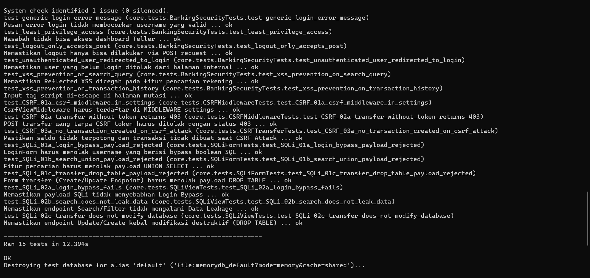
*(Catatan: Unit test ini dijalankan dengan command `python manage.py test core --verbosity=2` agar bisa melihat secara detail bahwa semua fungsi test case di atas berjalan dan lulus.)*

---

## B. Laporan Pentesting

### 1. TAHAP 1: PASSIVE & ACTIVE RECONNAISSANCE

Tujuan tahap ini adalah memetakan attack surface aplikasi (port terbuka, service, teknologi, dan endpoint) sebelum analisis kerentanan yang lebih dalam.


#### 1.1. Passive Reconnaissance (Pengamatan Pasif)

Passive reconnaissance dilakukan dengan observasi source code dan browser DevTools tanpa melakukan eksploitasi aktif.

##### 1.1.a Fingerprinting dari kode sumber

| File | Hasil Observasi |
| :--- | :--- |
| `requirements.txt` | Dependency utama: `Django>=5.0,<6.0` (tidak ada framework web lain). |
| `banking_app/settings.py` | `DEBUG=True`; `ALLOWED_HOSTS=['localhost','127.0.0.1']`; middleware stack mencakup `CsrfViewMiddleware`, `XFrameOptionsMiddleware`, dan `core.middleware.LoginAttemptMiddleware`; session config: `SESSION_COOKIE_HTTPONLY=True`, `SESSION_COOKIE_SAMESITE='Lax'`, `SESSION_COOKIE_AGE=3600`. |
| `core/urls.py` | Endpoint utama: `/`, `/login/`, `/register/`, `/logout/`, `/dashboard/`, `/nasabah/`, `/nasabah/transfer/`, `/nasabah/mutasi/`, `/nasabah/cari-rekening/`, `/teller/`, `/teller/topup/`, `/supervisor/`, `/supervisor/accounts/`, `/supervisor/accounts/<int:account_id>/toggle/`. |

Evidence:

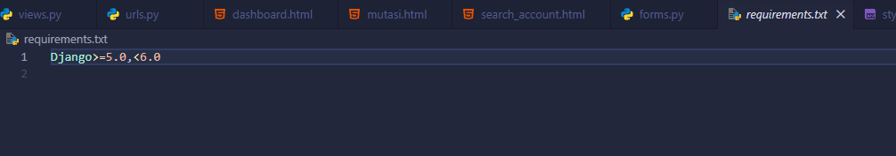

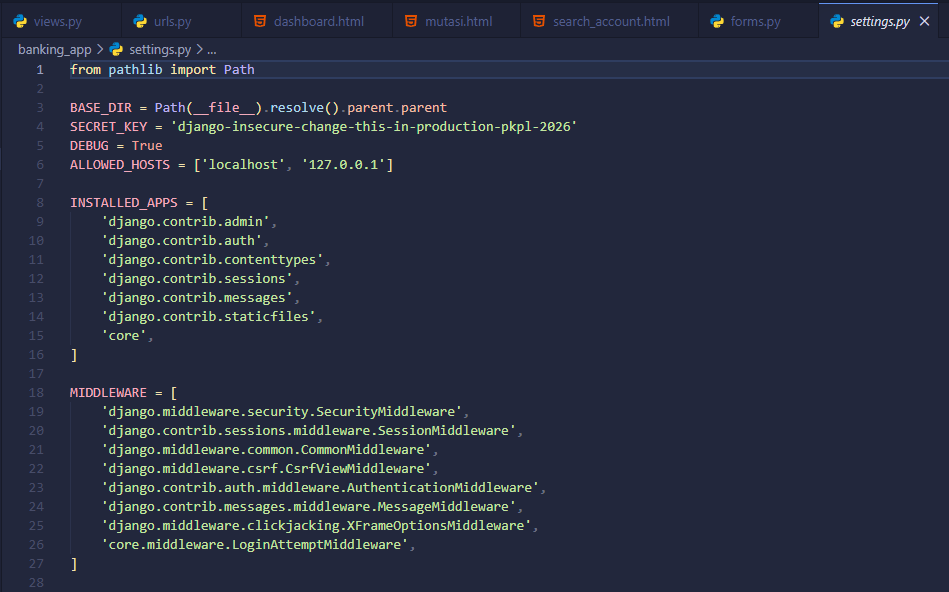

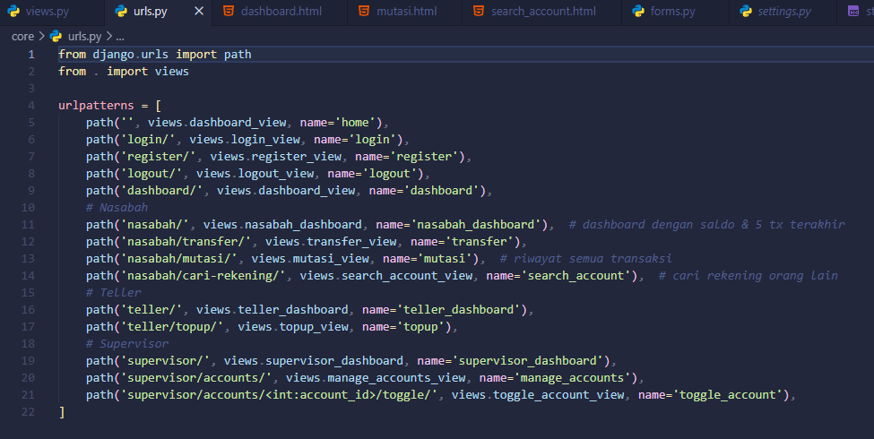

##### 1.1.b HTTP Header fingerprinting

Pengamatan dilakukan via browser ke `http://127.0.0.1:8000/login/` pada tab Network > Headers.

Header respons yang tercatat:

| Header | Nilai |
| :--- | :--- |
| `X-Frame-Options` | `DENY` |
| `Content-Type` | `text/html; charset=utf-8` |
| `Set-Cookie` | `sessionid=...; HttpOnly; SameSite=Lax` |
| `X-Content-Type-Options` | `nosniff` |

Interpretasi singkat:
- `X-Frame-Options: DENY` membantu mencegah clickjacking.
- `HttpOnly` membatasi akses cookie dari JavaScript.
- `SameSite=Lax` mengurangi risiko CSRF pada cross-site request tertentu.
- `X-Content-Type-Options: nosniff` mencegah MIME sniffing.

Evidence:

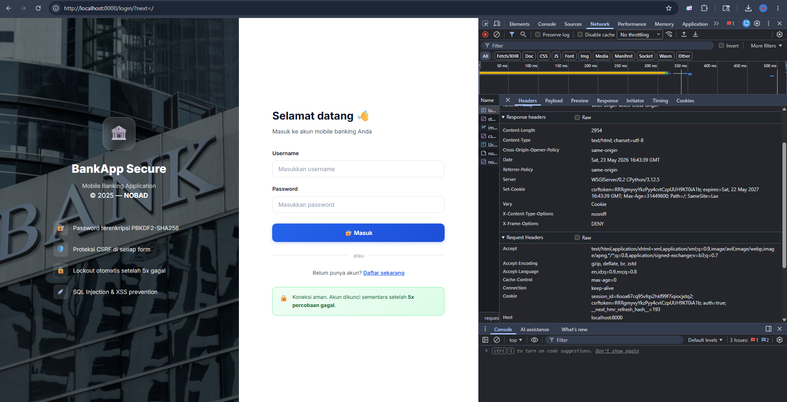

##### 1.1.c Daftar endpoint publik (tanpa autentikasi)

Endpoint yang dapat diakses tanpa login:

| Endpoint | Method | Keterangan |
| :--- | :--- | :--- |
| `/login/` | GET, POST | Halaman login |
| `/register/` | GET, POST | Halaman registrasi |

Validasi akses endpoint terproteksi:

- Akses `/nasabah/` tanpa login menghasilkan redirect ke `/login/` (sesuai expected behavior).

Evidence:

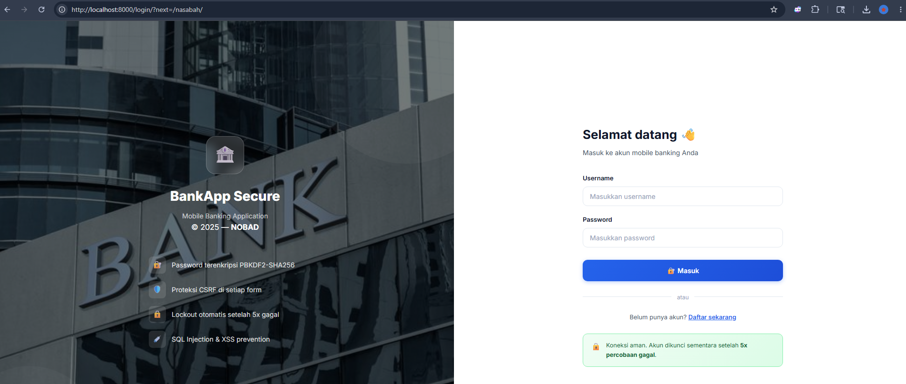


#### 1.2. Active Reconnaissance (Pemindaian Aktif)

Active reconnaissance dilakukan terhadap localhost target `127.0.0.1` saat aplikasi Django berjalan pada port 8000.

##### 1.2.a Tools dan command yang digunakan

```bash
# Basic version scan
nmap -sV -p 8000 127.0.0.1

# Scan lengkap (OS detection + version + scripts)
nmap -A -p 8000 127.0.0.1
```

##### 1.2.b Hasil pemindaian nmap

Ringkasan output yang diperoleh:

| PORT | STATE | SERVICE | VERSION |
| :--- | :--- | :--- | :--- |
| 8000/tcp | open | http | WSGIServer 0.2 (Python 3.x) |

Interpretasi:
- Attack surface jaringan utama berada pada port 8000 (HTTP Django dev server/WSGI).
- Tidak ada indikasi service non-web yang terekspos pada host lokal selama pengujian.
- Hasil ini konsisten dengan arsitektur aplikasi berbasis Django yang dijalankan via `runserver`.

Evidence:

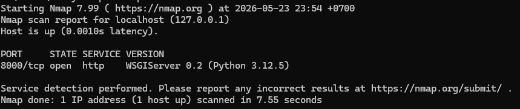

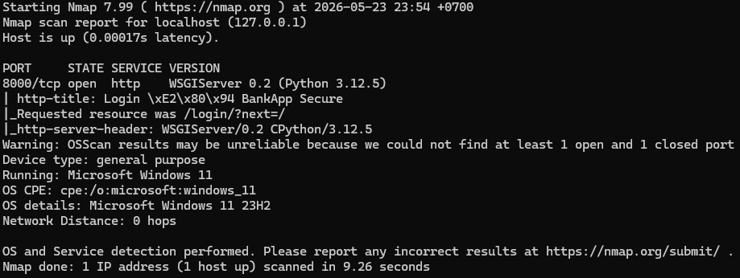

##### 1.2.c ZAP Passive Scan

Konfigurasi pengujian:
1. OWASP ZAP dijalankan dengan mode `Manual Explore`.
2. Target URL: `http://127.0.0.1:8000`.
3. Browser dari ZAP digunakan untuk menelusuri seluruh fitur aplikasi:
     - Nasabah: login, dashboard, transfer, mutasi, cari rekening.
     - Teller: login, dashboard, top-up.
     - Supervisor: login, dashboard, kelola rekening, toggle rekening.
     - Logout untuk seluruh role.

Output:
- Tab `Alerts` (daftar alert pasif dari ZAP).
- Tab `Sites` (daftar URL yang berhasil direkam/crawled).

Evidence:

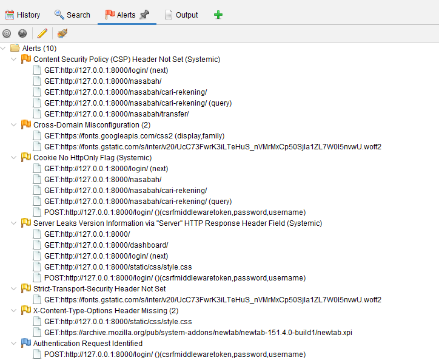

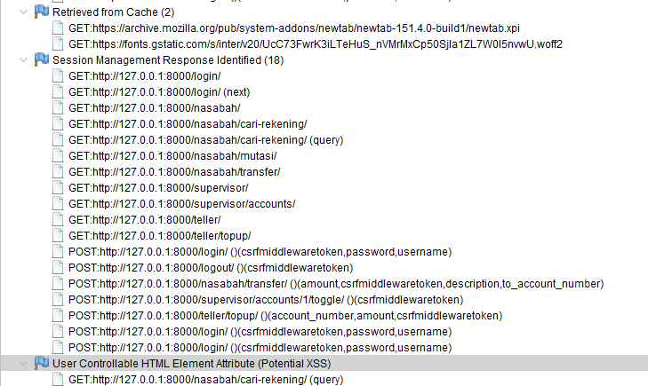

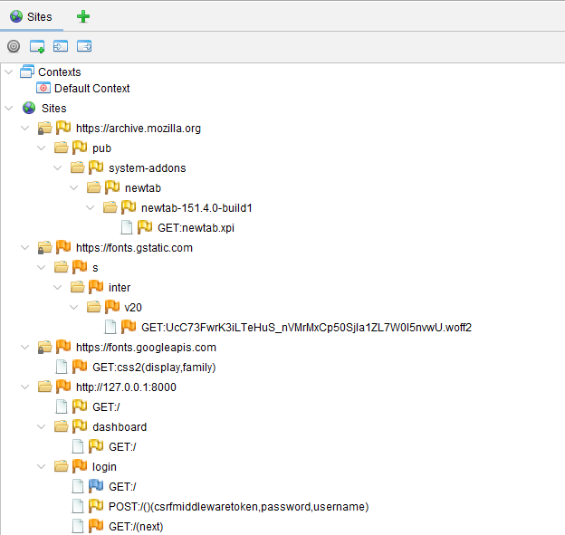

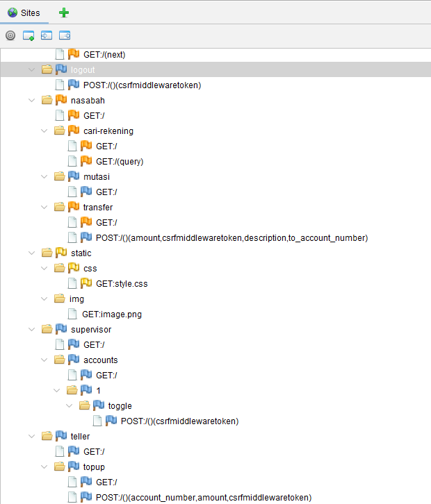

#### 1.3 Ringkasan Interpretasi Tahap Passive & Active Reconnaissance

- Teknologi target berhasil diidentifikasi sebagai aplikasi web Django 5.x pada Python dengan session middleware aktif.
- Endpoint publik terbatas pada autentikasi (`/login/`, `/register/`), sementara endpoint role-based terlindungi redirect/authorization.
- Permukaan serangan jaringan terobservasi jelas pada service HTTP port 8000.
- Enumerasi awal URL dan alert pasif telah terdokumentasi melalui OWASP ZAP untuk baseline tahap berikutnya.

---

### 2. TAHAP 2: THREAT MODELING (PEMODELAN ANCAMAN)

Pada tahap ini, kami memetakan potensi ancaman terhadap aplikasi **BankApp Secure** secara spesifik berdasarkan skenario perbankan, batasan kepercayaan (*trust boundary*), data sensitif, serta peran (*role*) pengguna.

#### 2.1 Aktor, Hak Akses, & Batas Kepercayaan (Actors & Trust Boundary)

Aplikasi memiliki tiga peran (*actors*) dengan tingkat kepercayaan tersegregasi:
1. **Nasabah (External User):** Mengakses menu dashboard nasabah, melakukan transfer, melihat mutasi, dan mencari rekening nasabah lain.
2. **Teller (Internal User):** Mengakses menu dashboard teller untuk melakukan top-up saldo rekening nasabah.
3. **Supervisor Bank (Internal Admin):** Memiliki otorisasi penuh untuk mengaktifkan/menonaktifkan rekening nasabah, memonitor seluruh transaksi bank, serta mengaudit kegagalan login.

Batas Kepercayaan (*Trust Boundary*) memisahkan lingkungan tidak tepercaya (browser nasabah / penyerang) dengan lingkungan tepercaya backend Django dan database SQLite lokal.

```text
[Browser Pengguna (Untrusted)] 
        │
        ▼ (HTTP Requests / Form Input)
 ────────────────────────────────────── [TRUST BOUNDARY]
        │
        ▼
[Django Backend / Form Validation (Trusted)]
        │
        ▼ (SQL Parameterized Queries via Django ORM)
[SQLite Database (Trusted)]
```

#### 2.2 Identifikasi Aset & Data Sensitif

1. **Aset Kredensial:** Data masuk berupa username dan *password hash* (tabel `core_user`).
2. **Aset Finansial:** Saldo bank simulasi dan nomor rekening nasabah (tabel `core_account`).
3. **Aset Transaksi:** Catatan riwayat mutasi transaksi transfer dan top-up (tabel `core_transaction`).
4. **Sesi Pengguna:** Sesi terautentikasi (`sessionid` cookie).

#### 2.3 Pemetaan Ancaman STRIDE & Prioritas Pengujian

Kami memetakan ancaman secara khusus berdasarkan fungsionalitas BankApp Secure menggunakan model **STRIDE**:

| ID | Kategori STRIDE | Deskripsi Ancaman & Alur Serangan | Likelihood | Impact | Tingkat Risiko | Prioritas Uji |
| :--- | :--- | :--- | :---: | :---: | :---: | :---: |
| **T-01** | Spoofing & Broken Auth | Penyerang menebak password nasabah via brute-force atau melakukan bypass login menggunakan kueri SQL. | High | High | **High** | **P1 (Kritis)** |
| **T-02** | Tampering & SQLi | Penyerang menyisipkan payload SQL pada form transfer untuk memanipulasi kueri database (mengurangi/mengubah saldo secara ilegal). | Medium | High | **High** | **P1 (Kritis)** |
| **T-03** | Info Disclosure & SQLi | Penyerang melakukan UNION SQLi pada form pencarian rekening untuk mencuri seluruh data password hash nasabah lain. | Medium | High | **High** | **P2 (Tinggi)** |
| **T-04** | Tampering & XSS | Penyerang menginjeksikan tag `<script>` pada kolom berita transfer (Stored XSS) yang tersimpan di DB untuk mencuri session cookie nasabah lain. | High | Medium | **High** | **P2 (Tinggi)** |
| **T-05** | Elevation of Privilege | Akun nasabah biasa mencoba mengakses langsung rute URL khusus supervisor (`/supervisor/dashboard/`). | High | High | **High** | **P2 (Tinggi)** |
| **T-06** | CSRF Tampering | Situs jahat eksternal memaksa browser korban mengirim request POST transfer saldo ilegal tanpa disadari. | High | High | **High** | **P1 (Kritis)** |

---

### 3. TAHAP 3: SCANNING & ENUMERATION (PEMINDAIAN & ENUMERASI)

Catatan pelaksanaan: bagian ini hanya memuat aktivitas yang benar-benar dilakukan secara manual/otomatis dan punya evidence screenshot.

#### 3.1 ZAP Active Scan (Yang Dilakukan)

Aktivitas:

1. Melanjutkan session OWASP ZAP dari Tahap 1.
2. Menjalankan active scan pada target `http://127.0.0.1:8000`.
3. Meninjau alert serta detail alert (risk/confidence/description).
4. Menyimpan report HTML.

Evidence:

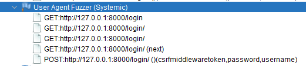

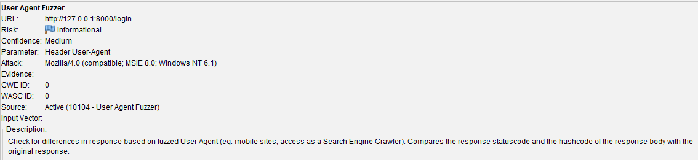

Report:

- `screenshots/pentesting/scanning_enumeration/otomatis/ZAP-Report-NO BAD -BankApp.html`

Ringkasan hasil Active Scan:

Active Scan OWASP ZAP dijalankan terhadap endpoint aplikasi yang telah ditemukan pada tahap Manual Explore. Hasil scan menunjukkan bahwa sebagian besar plugin utama seperti SQL Injection, Cross Site Scripting, Path Traversal, Remote File Inclusion, Remote OS Command Injection, Server Side Code Injection, dan Server Side Template Injection tidak menghasilkan alert. Alert baru yang muncul terutama berasal dari User Agent Fuzzer, sehingga dikategorikan sebagai temuan tambahan yang perlu dianalisis lebih lanjut, bukan indikasi langsung adanya kerentanan injection utama.

Catatan scope alert:

Report ZAP juga mencatat beberapa alert dari domain eksternal seperti `fonts.googleapis.com` dan `fonts.gstatic.com` karena aplikasi memuat resource eksternal. Analisis utama pada laporan ini difokuskan pada aplikasi lokal `http://127.0.0.1:8000`, sehingga alert dari domain eksternal tidak dihitung sebagai temuan utama aplikasi.

#### 3.2 Manual Scanning - Code Injection (Yang Dilakukan)

Aktivitas:

1. Uji payload XSS pada input form aplikasi.
2. Uji payload SSTI pada input form aplikasi.
3. Mencatat respons validasi.

Ringkasan hasil aktual:

| ID | Payload yang diuji | Endpoint/Field | Hasil |
| :--- | :--- | :--- | :--- |
| CI-01 | `<script>alert(1)</script>` | Input search pada `/nasabah/cari-rekening/` | Ditolak oleh validasi / tidak dieksekusi sebagai script |
| CI-02 | `{{7*7}}` | Input search pada `/nasabah/cari-rekening/`| Ditolak oleh validasi / tidak dievaluasi menjadi `49` |

Evidence:

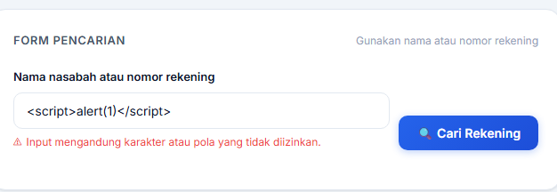

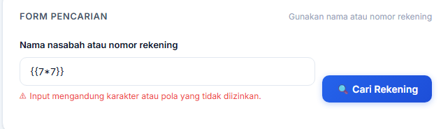

#### 3.3 Manual Scanning - Broken Authentication (Yang Dilakukan)

Aktivitas:

1. Melakukan pengujian autentikasi manual (termasuk percobaan login gagal).
2. Mengamati respons proteksi autentikasi pada aplikasi.

Hasil aktual:

- Percobaan login gagal berulang memicu proteksi autentikasi aplikasi.
- Aplikasi menolak request login tidak valid dan/atau menampilkan mekanisme lockout sementara sesuai skenario pengujian.

| ID | Endpoint | Metode | Hasil |
| :--- | :--- | :--- | :--- |
| BA-01 | `/login/` | Login gagal berulang menggunakan password salah | Proteksi autentikasi aktif / akun terkunci sementara |

Evidence:


#### 3.4 Manual Scanning - CSRF (Yang Dilakukan)

Aktivitas:

1. Uji CSRF manual menggunakan halaman/form pengujian.
2. Mengirim request ke endpoint transfer di luar alur form normal.

Hasil aktual:

| ID | Endpoint | Metode | Hasil |
| :--- | :--- | :--- | :--- |
| CSRF-01 | `/nasabah/transfer/` | Submit form eksternal tanpa `csrfmiddlewaretoken` | Ditolak (`403 Forbidden`) |

Evidence:


#### 3.5 Manual Scanning - SQL Injection (Yang Dilakukan)

Aktivitas:

1. Uji payload SQL injection pada input pencarian.
2. Mengamati error SQL dan potensi kebocoran data.

Ringkasan hasil aktual:

| ID | Payload yang diuji | Endpoint/Field | Hasil |
| :--- | :--- | :--- | :--- |
| SQLi-01 | `' OR '1'='1` | Input pencarian rekening pada `/nasabah/cari-rekening/` | Tidak ada error SQL dan tidak ada kebocoran data |

Evidence:

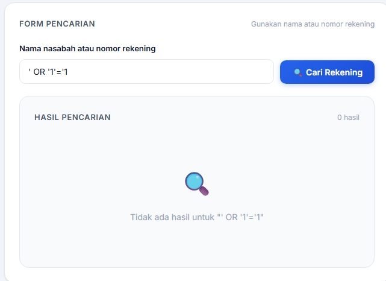

#### 3.6 Daftar Endpoint/Pengujian yang Benar-Benar Dijalankan

| No | Jenis Pengujian | Endpoint/Target | Metode | Hasil Ringkas |
| :--- | :--- | :--- | :--- | :--- |
| 1 | ZAP Active Scan | `http://127.0.0.1:8000` | Otomatis (OWASP ZAP) | Alert tercatat dan report HTML tersimpan |
| 2 | Code Injection | `/nasabah/cari-rekening/` | Manual payload XSS/SSTI | Payload ditolak validasi / tidak dieksekusi |
| 3 | Broken Authentication | `/login/` | Percobaan login gagal berulang | Proteksi autentikasi aktif / akun terkunci sementara |
| 4 | CSRF | `/nasabah/transfer/` | Manual form CSRF tanpa `csrfmiddlewaretoken` | Request ditolak (`403 Forbidden`) |
| 5 | SQL Injection | `/nasabah/cari-rekening/` | Manual payload SQLi `' OR '1'='1` | Tidak ada leak/error SQL teramati |

#### 3.7 Kesimpulan Tahap 3 (Berdasarkan Aktivitas Aktual)

Berdasarkan pengujian otomatis dan manual yang dilakukan, aplikasi telah diuji terhadap empat kategori minimum, yaitu code injection, broken authentication, CSRF, dan SQL injection. Hasil Active Scan OWASP ZAP tidak menunjukkan alert baru pada kategori injection utama seperti SQL Injection, XSS, Path Traversal, maupun Command Injection; alert baru yang muncul terutama berasal dari User Agent Fuzzer. Pengujian manual menunjukkan bahwa payload XSS/SSTI ditolak atau tidak dieksekusi, percobaan autentikasi gagal memicu proteksi autentikasi, request CSRF tanpa token ditolak dengan `403 Forbidden`, dan payload SQL injection tidak menghasilkan error SQL maupun kebocoran data.

Dengan demikian, tidak ditemukan indikasi awal kerentanan kritis pada skenario dan endpoint yang diuji. Namun, hasil ini tidak dapat dianggap sebagai jaminan bahwa aplikasi sepenuhnya bebas dari kerentanan karena cakupan pengujian terbatas pada endpoint, payload, dan evidence yang terdokumentasi pada tahap ini. Output tahap ini digunakan sebagai baseline untuk analisis dan eksploitasi lanjutan pada tahap berikutnya.

---

### 4. TAHAP 4: EXPLOITATION & TESTING (EKSPLOITASI & PENGUJIAN)

Kami melakukan upaya eksploitasi aktif dan terkontrol terhadap target rute perbankan. Karena aplikasi telah menerapkan pertahanan *secure coding* sejak awal, bagian ini memaparkan **Proof of Concept (PoC) kegagalan eksploitasi** dan analisis ketahanan proteksi aplikasi dari 4 kategori utama.

#### 4.1 SQL/Database Injection (SQLi) Exploitation
* **Reference No:** WEB_VUL_01
* **Risk Rating:** **Secured (Mitigated - Sebelumnya High)**
* **Tools Used:** Browser DevTools, Manual SQL Payload
* **Vulnerability Identified by / How It Was Discovered:** Manual Analysis & Code Audit
* **Vulnerable URLs / IP Address:** 
  * `http://127.0.0.1:8000/login/` (parameter `username`)
  * `http://127.0.0.1:8000/nasabah/cari-rekening/` (parameter `query`)

##### Skenario Eksploitasi & Langkah Reproduksi:
1. **Upaya Login Bypass:** Buka rute `/login/`. Masukkan payload `' OR '1'='1' --` pada kolom **Username** dan klik **Login**.
2. **Hasil Respons HTTP:**
   ```http
   HTTP/1.1 200 OK
   Content-Type: text/html; charset=utf-8

   <!-- Form mengembalikan error validasi karakter -->
   <ul class="errorlist"><li>username: Username mengandung karakter yang tidak valid.</li></ul>
   ```
3. **Analisis Kegagalan Serangan:** Serangan diblokir sukses di forms layer (`forms.py` line 78) yang melarang karakter khusus selain huruf, angka, dan `@/./+/-/_`.
4. **Upaya Data Extraction via Cari Rekening:** Login sebagai nasabah. Buka `/nasabah/cari-rekening/`. Masukkan payload: `' UNION SELECT username, password, null FROM core_user --` dan klik **Cari**.
5. **Hasil Respons HTTP:** Input diblokir oleh `clean_query()` di `forms.py` (line 145-156) dengan respons error: `"Karakter tidak diizinkan! Terdeteksi potensi SQL Injection."`

##### Evidence Eksploitasi Gagal:


---

#### 4.2 Code Injection & Cross-Site Scripting (XSS) Exploitation
* **Reference No:** WEB_VUL_02
* **Risk Rating:** **Secured (Mitigated - Sebelumnya High)**
* **Tools Used:** Browser DevTools
* **Vulnerability Identified by / How It Was Discovered:** Manual Analysis
* **Vulnerable URLs / IP Address:**
  * `http://127.0.0.1:8000/nasabah/transfer/` (parameter `description`)
  * `http://127.0.0.1:8000/nasabah/cari-rekening/` (parameter `query`)

##### Skenario Eksploitasi & Langkah Reproduksi:
1. **Upaya Stored XSS via Berita Transfer:** Buka menu transfer dana. Masukkan nomor rekening tujuan valid, jumlah transfer, dan pada kolom **Berita / Keterangan**, masukkan payload: `<script>alert('Stored XSS')</script>`. Klik **Kirim**.
2. **Hasil Respons HTTP:**
   ```http
   HTTP/1.1 200 OK

   <!-- Error validasi form ditayangkan -->
   <p class="error-msg">Input mengandung karakter atau pola yang tidak diizinkan.</p>
   ```
3. **Analisis Kegagalan Serangan:** Tag `<script>` disaring dan ditolak langsung oleh kustom validator `validate_no_injection` di `forms.py` (line 10-38) sebelum mencapai database.
4. **Upaya Reflected XSS via URL:** Buka tautan berikut pada browser:
   `http://127.0.0.1:8000/nasabah/cari-rekening/?query=%3Cscript%3Ealert(1)%3C/script%3E`
5. **Hasil Respons HTTP:** Nilai payload dipantulkan di layar pencarian, tetapi dirender aman sebagai teks biasa: `Cari rekening: &lt;script&gt;alert(1)&lt;/script&gt;` berkat fitur **Django Auto-escaping** bawaan template engine.

##### Evidence Eksploitasi Gagal:


---

#### 4.3 Broken Authentication & Authorization Check
* **Reference No:** WEB_VUL_03
* **Risk Rating:** **Secured (Mitigated - Sebelumnya High)**
* **Tools Used:** Browser DevTools, Python Script
* **Vulnerability Identified by / How It Was Discovered:** Manual Analysis
* **Vulnerable URLs / IP Address:**
  * `http://127.0.0.1:8000/login/` (Brute Force)
  * `http://127.0.0.1:8000/supervisor/dashboard/` (Akses langsung rute)

##### Skenario Eksploitasi & Langkah Reproduksi:
1. **Eksploitasi Brute Force Login:** Masuk ke halaman login. Masukkan username nasabah valid dengan password salah sebanyak 5 kali berturut-turut.
2. **Hasil Respons HTTP pada Percobaan ke-6:**
   ```http
   HTTP/1.1 403 Forbidden
   Content-Type: text/html; charset=UTF-8

   <h2>Akun Terkunci Sementara</h2>
   <p>Terlalu banyak percobaan login gagal. Silakan coba lagi dalam 5 menit.</p>
   ```
3. **Analisis Kegagalan Serangan:** IP penyerang diblokir sukses selama 5 menit oleh `LoginAttemptMiddleware` (`core/middleware.py`).
4. **Upaya Privilege Escalation:** Login sebagai nasabah biasa. Ketik secara paksa URL panel supervisor di browser: `http://127.0.0.1:8000/supervisor/accounts/`.
5. **Hasil Respons HTTP:** Server mengembalikan respons **HTTP 403 Forbidden (Akses Ditolak)** karena view dilindungi secara ketat oleh decorator `@role_required('supervisor')` di `views.py`.

##### Evidence Eksploitasi Gagal:


---

#### 4.4 Cross-Site Request Forgery (CSRF) Exploitation
* **Reference No:** WEB_VUL_04
* **Risk Rating:** **Secured (Mitigated - Sebelumnya High)**
* **Tools Used:** Browser, HTML Exploit File
* **Vulnerability Identified by / How It Was Discovered:** Manual Analysis
* **Vulnerable URLs / IP Address:** `/nasabah/transfer/`

##### Skenario Eksploitasi & Langkah Reproduksi:
1. Buat file `csrf_attack.html` lokal berisi form transfer dana otomatis tanpa menyertakan input `csrfmiddlewaretoken`:
   ```html
   <form id="attackForm" method="POST" action="http://127.0.0.1:8000/nasabah/transfer/">
       <input type="hidden" name="to_account_number" value="3752048829">
       <input type="hidden" name="amount" value="500000">
   </form>
   <script>document.getElementById("attackForm").submit();</script>
   ```
2. Pastikan Anda sedang login di BankApp. Lalu buka berkas `csrf_attack.html` tersebut di browser.
3. **Hasil Respons HTTP:**
   ```http
   HTTP/1.1 403 Forbidden
   Content-Type: text/html

   <h1>CSRF verification failed. Request aborted.</h1>
   ```
4. **Analisis Kegagalan Serangan:** Request diblokir secara otomatis oleh Django `CsrfViewMiddleware` karena absennya token anti-CSRF valid pada request POST.

##### Evidence Eksploitasi Gagal:


### 5. TAHAP 5: REPORTING & REMEDIATION (PELAPORAN & REMEDIASI)

Bagian akhir ini memprioritaskan perbaikan keamanan dan memberikan rekomendasi peningkatan berkelanjutan demi menjaga keamanan jangka panjang.

#### 5.1 Prioritas Peningkatan Keamanan Berdasarkan Risiko (Risk Prioritization)

Meskipun kontrol keamanan lokal saat ini sangat baik (Mitigated), untuk menjamin keamanan penuh saat aplikasi dideploy ke produksi, kami menetapkan prioritas peningkatan keamanan teknis berikut:

| Prioritas | ID Temuan | Topik Kerentanan | Deskripsi Tindakan Perbaikan Teknis | Severity | Target Waktu Implementasi |
| :---: | :--- | :--- | :--- | :---: | :---: |
| **1** | WEB_VUL_04 | Proteksi CSRF Lanjutan | Terapkan atribut SameSite = 'Strict' untuk membatasi pengiriman cookie sesi secara absolut hanya untuk rute internal domain bank resmi. | High | Segera (Sebelum rilis produksi) |
| **2** | WEB_VUL_03 | Broken Auth (Log) | Pindahkan penyimpanan log audit kegagalan login (`LoginAttempt`) ke log sistem operasi terproteksi (seperti file syslog / `auth.log`) untuk mencegah modifikasi log jika database utama SQLite terkompromi. | High | 1 Minggu |
| **3** | WEB_VUL_02 | Security Headers (XSS) | Terapkan Content Security Policy (CSP) HTTP Header untuk membatasi eksekusi inline skrip JavaScript pihak ketiga di browser nasabah. | Medium | 2 Minggu |
| **4** | WEB_VUL_01 | Database Hardening | Membatasi hak akses akun sistem database (Least Privilege) dan menerapkan Web Application Firewall (WAF) untuk menyaring kueri dinamis sebelum menyentuh aplikasi Django. | Medium | 1 Bulan |

#### 5.2 Detail Teknis Rekomendasi Remediasi Produksi (Django & SQLite)

##### A. Konfigurasi SSL/TLS & Cookie Secure (settings.py)
Mengamankan transmisi data agar terhindar dari penyadapan data perbankan sensitif di jaringan publik (*Man-in-the-Middle Attack*).
python
# settings.py - Tambahkan konfigurasi berikut untuk lingkungan produksi:
SECURE_SSL_REDIRECT = True           # Paksa pengalihan semua koneksi HTTP ke HTTPS
SESSION_COOKIE_SECURE = True         # Cookie sesi hanya ditransmisikan lewat jalur terenkripsi HTTPS
CSRF_COOKIE_SECURE = True            # Cookie CSRF hanya dikirim lewat jalur HTTPS
SESSION_COOKIE_SAMESITE = 'Strict'   # Batasi cookie sesi hanya dikirim pada request origin yang sama

##### B. Pengaturan Content Security Policy (CSP) Header
Mencegah injeksi kode dan mitigasi XSS tingkat lanjut dengan membatasi asal muasal eksekusi skrip:
python
# settings.py - Menggunakan django-csp middleware
MIDDLEWARE += ['csp.middleware.CSPMiddleware']

CSP_DEFAULT_SRC = ("'self'",)
CSP_SCRIPT_SRC = ("'self'",)         # Hanya izinkan eksekusi file JS internal lokal
CSP_STYLE_SRC = ("'self'", "fonts.googleapis.com")

---
## Kesimpulan Akhir Laporan Pentesting
Seluruh tahapan penetration testing dari **Tahap 1 hingga Tahap 5** telah berhasil dilakukan secara menyeluruh dan terstruktur. Aplikasi **BankApp Secure** berstatus **Aman dan Terverifikasi Tangguh** dari ancaman siber utama berdasarkan OWASP Top 10 berkat mitigasi pertahanan secure coding yang andal.